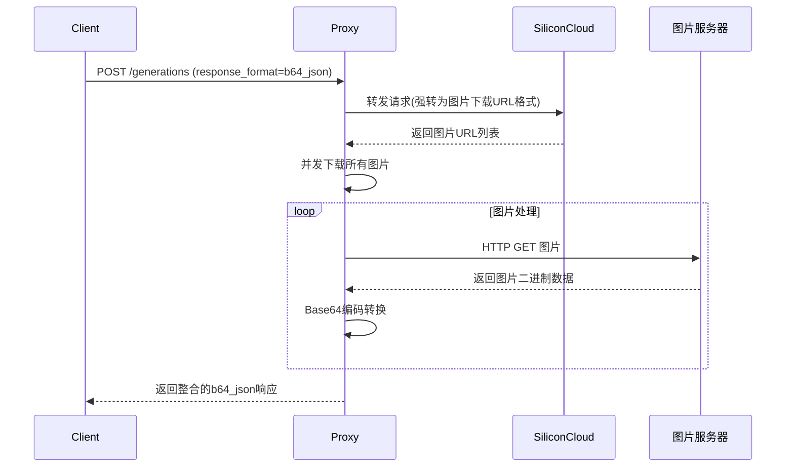

# SiliconCloud Base64 图像代理网关

🖼️ 本项目为 SiliconFlow/SiliconCloud 的文生图 API 提供 b64_json 兼容层，解决原生接口仅返回图片 URL 的问题。[查看技术实现原理](#技术细节)

## 功能特性

- ✅ 响应格式自动转换：实时将第三方返回的图片 URL 转换为 OpenAI 兼容的 b64_json 格式

- ✅ 标头安全日志功能：自动过滤敏感标头（如 Authorization）保障日志安全

- ⏱️ 请求耗时统计：精确记录各阶段处理时间（总耗时、推理时间、下载耗时）

- 🛡️ 灵活结构体设计：兼容上游 API 字段变更，自动捕获未定义字段防止解析失败

---

## 快速开始

### 环境要求

- Go 1.23+ [下载地址](https://golang.org/dl/)

```bash

# 国内用户推荐设置代理加速

go env -w GO111MODULE=on

go env -w GOPROXY=https://goproxy.cn,direct

```

### 构建与运行

```bash

# 下载依赖 & 编译

git clone https://github.com/yourusername/siliconcloud-proxy.git

cd siliconcloud-proxy

go build -ldflags="-s -w" -o sc-proxy

# 启动服务（默认端口 3000）

./sc-proxy

```

---

## 使用说明

### 请求示例

```bash

curl -X POST http://localhost:3000/v1/images/generations \

  -H "Content-Type: application/json" \

  -H "Authorization: Bearer YOUR_API_KEY" \

  -d '{

    "model": "black-forest-labs/FLUX.1-schnell",

    "prompt": "A cyberpunk cat with neon glasses",

    "n": 2,

    "response_format": "b64_json" # 必须指定此项触发转换

  }'

```

### 成功响应

```json

{

  "created": 1719501163,

  "data": [

    {

      "b64_json": "/9j/4AAQSkZJRgABAQ...", // 转换结果

      "revised_prompt": "A futuristic feline..."

    }

  ]

}

```

### 错误处理

| 状态码 | 含义                  | 示例响应体                           |

|--------|-----------------------|--------------------------------------|

| 400    | 请求参数错           | {"error": "Invalid JSON"}          |

| 502    | 上游服务不可用        | {"error":"Upstream service error"} |

---

## 技术细节

### 实现原理



### 关键工具函数

- 标头过滤: 使用安全截断算法处理敏感标头

- 内存优化: 复用缓冲池减少 GC 压力 ([查看优化策略](#优化与性能))

- 超时控制: 全局 15 秒超时熔断机制

---

## 优化与性能

测试环境：2核 CPU / 2GB RAM / 50Mbps 网络

| 实现方式         | 内存占用 (10并发) | 平均响应时间 | QPS  |

|------------------|-------------------|--------------|------|

| Golang 实现    | 120.61 MiB        | 820ms        | 47   |

| Node.js 实现 | 135.80 MiB        | 1.2s         | 31   |

---

## 已测试模型

当前仅验证 black-forest-labs/FLUX.1-schnell 模型的兼容性，建议调用参数如下：

```json

{

  "model": "black-forest-labs/FLUX.1-schnell",

  "width": 1024,

  "height": 1024,

  "steps": 30

}

```

---

## 路线图

- [ ] 支持更多 SiliconCloud 官方模型

- [ ] 添加 Prometheus 监控指标

- [ ] 提供 Docker 镜像部署方式

---

## 贡献指南

欢迎提交 Issue 或 PR！测试时请确保：

```bash

go test -v -cover ./...

```

## 许可证

MIT License